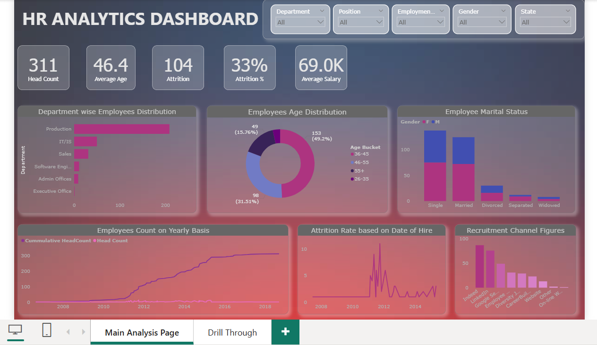

# 👩‍💼 HR Analytics Dashboard

A Power BI dashboard designed to uncover actionable insights from HR data, such as employee attrition, recruitment effectiveness, departmental distributions, and workforce demographics. This interactive dashboard aids HR teams and business leaders in making strategic workforce decisions.

---

## 📊 Project Overview

This HR Analytics dashboard provides a comprehensive look at the company’s human resource metrics including attrition, age distribution, recruitment channels, and employee lifecycle trends. It helps answer key questions about staff retention, hiring patterns, and workforce structure.

---

## 📌 Key Insights

- **Total Headcount**: 311 employees
- **Attrition Rate**: 33% (104 employees left)
- **Average Age**: 46.4 years
- **Average Salary**: $69K
- **Top Department**: Production dominates in terms of employee count

### 🧩 Drill-Through View Highlights

- Individual employee records with demographics, employment status, salary, and recruitment source.
- Key drillable dimensions: Manager, State, Employment Status, and Recruitment Channel.

---

## 📁 Project Features

- **Dynamic Filters**: Department, Position, Employment Status, Gender, and State
- **Donut Charts**: Age and marital status distribution
- **Bar Charts**: Department-wise count and recruitment channel usage
- **Line Charts**: Headcount and attrition over time
- **Drill-Through Page**: Detailed employee-level data for deep-dives

---

## 🛠️ Tools Used

The dashboard was built using the following tools and technologies: 
•	📊 Power BI Desktop – Main data visualization platform used for report creation. 
•	📂 Power Query – Data transformation and cleaning layer for reshaping and preparing the data. 
•	🧠 DAX (Data Analysis Expressions) – Used for calculated measures, dynamic visuals, and conditional logic. 
•	📝 Data Modeling – Relationships established among tables to enable cross-filtering and aggregation. 
•	📁 File Format – .pbix for development and .png for dashboard previews.

---

## 🖼️ Project Demo

### 🔍 Main Analysis Page

---

## 🚀 How to Use

1. Open the `.pbix` file using Power BI Desktop.
2. Navigate between the **Main Analysis Page** and the **Drill Through Page**.
3. Use slicers at the top to filter data by Department, Gender, Employment Status, etc.
4. Hover or click on visual elements for deeper analysis and tooltips.

---

## 🎯 Business Questions Answered

- What is the company-wide attrition rate and which departments are most affected?
- Which recruitment channels are most effective?
- What is the age and gender distribution of the workforce?
- How does attrition trend over time or by date of hire?
- Who are the active employees by manager or department?

---

## 🔍 Future Enhancements

- Predictive analytics for attrition using ML models
- Integration with live data sources (e.g., SQL Server, SharePoint)
- Export to PDF or email reporting

---

## 🧠 Feedback & Contributions

Feel free to open an issue or submit a pull request if you'd like to contribute or suggest improvements!
